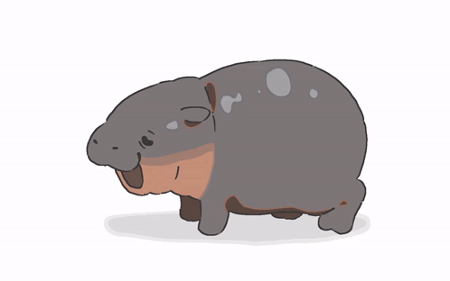

<h1 align="center">Enter Benjaman</h1>
<h3 align="center">Full Stack Developer Candidate

  <em>
   I'm Ben an aspiring Full Stack Developer taking a diploma course at Mission Ready HQ     
  I have participated in projects which have built the foundation of my skills and mindset as a programmer    
  I am particularly interested in exploring AI and how they can be integrated with web applications   
    I want to absorb as much as I can to be the best developer I can be   
    I have a long journey ahead of me but I am excited to take every step wherever it may lead me
   
     
  </em>

***About Me***

I was formerly an Accounts Assistant  
I like to keep active with exercise and sports 
My top 3 animals are wolves, bears, and hippos 
In my free time I like to game 
  My music ranges from Nightwish to Taylor Swift 
Fun fact : I once ate 9 cups of rice in a single meal

 

***Current Techstack***

  

 

  

